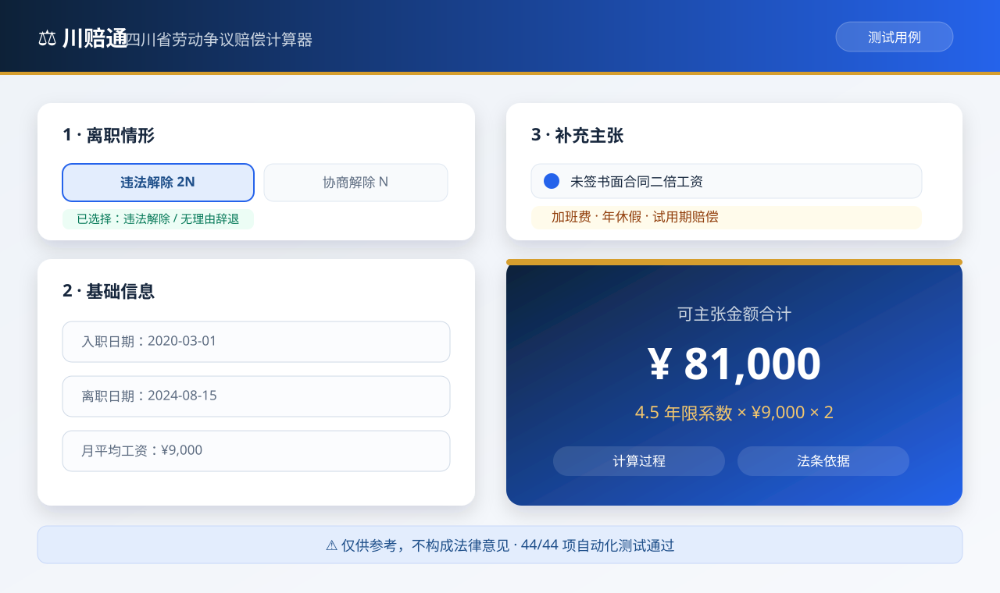

<p align="center">
  
</p>

# 川赔通 · 四川省劳动争议赔偿计算器

<p align="center">
  <a href="https://rg2gycv8bv-byte.github.io/sichuan-labor-dispute-calculator/">
    
  </a>
  <a href="https://github.com/rg2gycv8bv-byte/sichuan-labor-dispute-calculator/actions/workflows/tests.yml">
    
  </a>
  
  
  
</p>

<p align="center">
  一个基于《劳动合同法》等规定的劳动争议赔偿测算工具。<br>
  纯前端实现，浏览器直接打开即可使用，无需安装任何依赖。
</p>

<p align="center">
  <a href="https://rg2gycv8bv-byte.github.io/sichuan-labor-dispute-calculator/"><strong>🚀 在线体验</strong></a> ·
  <a href="https://rg2gycv8bv-byte.github.io/sichuan-labor-dispute-calculator/test.html"><strong>🧪 查看测试</strong></a> ·
  <a href="https://github.com/rg2gycv8bv-byte/sichuan-labor-dispute-calculator"><strong>📦 源码仓库</strong></a>
</p>

<p align="center">
  
</p>

## ✨ 核心功能

- **十种离职情形**自动判断补偿口径：协商解除（N）、被迫解除（N）、期满终止（N）、医疗期满 / 不能胜任 / 客观情况变化解除（N+1）、违法解除（2N）、主动辞职 / 过失性辞退 / 维持条件续签（无补偿）
- **七大计算项目**：经济补偿金、违法解除赔偿金、代通知金、未签书面合同二倍工资、加班费（150% / 200% / 300%）、未休年休假工资、违法约定试用期赔偿金
- **四川本地化**：社平工资三倍封顶、最低工资兜底、劳动仲裁时效提醒（一年）
- **报告输出**：逐项金额 + 计算过程 + 法条依据 + 证据清单 + 下一步建议，支持打印 / 导出 PDF
- **进阶开关**：跨 2008 年 1 月 1 日的工龄分段计算

## 🧮 计算口径

| 项目 | 规则 | 依据 |
| --- | --- | --- |
| 经济补偿金（N） | 每满 1 年支付 1 个月工资；满 6 个月不满 1 年按 1 年；不满 6 个月支付半个月。月工资 = 离职前 12 个月平均应发工资 | 《劳动合同法》第 47 条 |
| 高收入封顶 | 月工资高于本地上年度职工月平均工资 3 倍的，按 3 倍支付，年限最高不超过 12 年 | 《劳动合同法》第 47 条 |
| 违法解除赔偿金（2N） | 违法解除或终止的，按经济补偿标准的 2 倍支付 | 《劳动合同法》第 87 条 |
| 代通知金（+1） | 第 40 条情形解除且未提前 30 日书面通知的，额外支付 1 个月工资（按上月工资标准） | 《劳动合同法实施条例》第 20 条 |
| 未签合同二倍工资 | 自用工满 1 个月的次日起算，最多 11 个月 | 《劳动合同法》第 82 条、《实施条例》第 6、7 条 |
| 加班费 | 工作日延时 150%、休息日未补休 200%、法定节假日 300%；日工资 = 月工资 ÷ 21.75 | 《劳动法》第 44 条 |
| 未休年假 | 未休天数 × 日工资 × 200%（300% 中含正常工资） | 《职工带薪年休假条例》第 3、5 条 |
| 试用期赔偿 | 超出法定上限且已履行的期间 × 转正后月工资 | 《劳动合同法》第 83 条 |
| 仲裁时效 | 一年，自知道或应当知道权利被侵害之日起算 | 《劳动争议调解仲裁法》第 27 条 |

## 🧪 内置测试案例

以下 6 个主案例已内置，可在首页“载入示例案例”下拉框中直接载入；完整清单见 `tests.js`。

| 案例 | 输入 | 期望结果 |
| --- | --- | --- |
| 1 · 违法解除（2N） | 2020-03-01 入职，2024-08-15 被辞退，月均 9,000 元 | 系数 4.5，赔偿金 **81,000 元** |
| 2 · 合法解除 + 代通知金 | 不能胜任解除，未提前通知，月均 8,000 元，上月 8,500 元 | N = 44,000 + 8,500 = **52,500 元** |
| 3 · 高收入封顶 | 月均 45,000 元，社平 8,000 元（3 倍 = 24,000） | 按 24,000 元计，**240,000 元** |
| 4 · 未签合同二倍工资 | 2024-02-01 入职，12-31 离职未签，月 7,000 元 | 10 个月 × 7,000 = **70,000 元** |
| 5 · 加班费组合 | 基数 6,525 元，延时 40h + 休息日 64h + 节假日 8h | 时薪 37.5 元，合计 **7,950 元** |
| 6 · 未休年假 | 工龄 12 年（年假 10 天），未休 6 天，月均 8,700 元 | 日工资 400 元，**4,800 元** |

另有边界用例：恰好 6 个月、5 个月 29 天、二倍工资 11 个月封顶、2008 年分段、低于最低工资兜底、试用期上限（3 个月 / 1 年 / 3 年 / 无固定）等，共 **44 项测试**。

## 🚀 快速开始

```bash
# 方式一：直接双击 index.html，用浏览器打开

# 方式二：运行自动化测试
node run-tests.js
```

## 📁 项目结构

```text
├── index.html      # 主应用页面
├── test.html      # 浏览器测试页面
├── style.css      # 样式（含打印样式）
├── calculator.js  # 核心计算逻辑（纯函数，可独立测试）
├── tests.js       # 业务案例与单元测试
├── run-tests.js   # Node.js 命令行测试入口
└── assets/         # 横幅与界面预览
```

## 📌 参数说明

工具内置的“上年度职工月平均工资”与“当地最低工资”为**示例参数**（默认 8,000 元 / 2,100 元）。正式使用前，请以四川省人力资源和社会保障厅、成都市统计局最新公布数据在页面“计算参数”中更新。

简化口径说明：二倍工资差额按自然月计数（不足整月按 1 个月计，最多 11 个月）；实践中部分仲裁机构按实际天数折算，结果可能略有差异。

## ⚠️ 免责声明

本项目为课程作业演示用途，计算结果仅供参考，不构成法律意见。具体案件请咨询执业律师或当地劳动人事争议仲裁机构。
